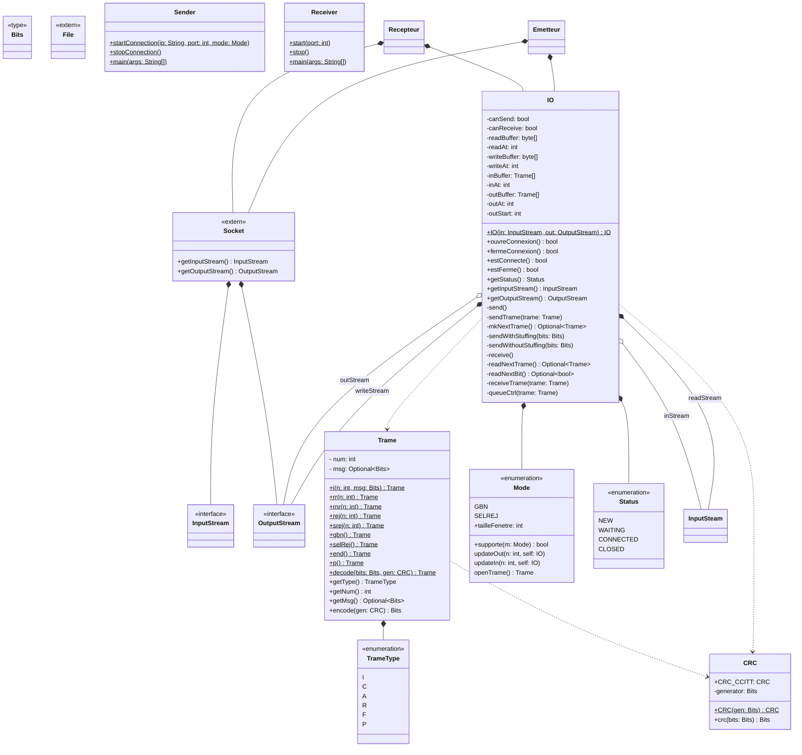

```mermaid
classDiagram
	class Bits {
		<<type>>
	}
	class IO {
		-canSend: bool
		-canReceive: bool
		-readBuffer: byte[]
		-readAt: int
		-writeBuffer: byte[]
		-writeAt: int
		-inBuffer: Trame[]
		-inAt: int
		-outBuffer: Trame[]
		-outAt: int
		-outStart: int
		+IO(in: InputStream, out: OutputStream)$ IO
		+ouvreConnexion() bool
		+fermeConnexion() bool
		+estConnecte() bool
		+estFerme() bool
		+getStatus() Status
		+getInputStream() InputStream
		+getOutputStream() OutputStream
		-send()
		-sendTrame(trame: Trame)
		-mkNextTrame() Optional~Trame~
		-sendWithStuffing(bits: Bits)
		-sendWithoutStuffing(bits: Bits)
		-receive()
		-readNextTrame() Optional~Trame~
		-readNextBit() Optional~bool~
		-receiveTrame(trame: Trame)
		-queueCtrl(trame: Trame)
	}
	class Socket {
		<<extern>>
		+getInputStream() InputStream
		+getOutputStream() OutputStream
	}
	class InputStream {
		<<interface>>
		<<extern>>
	}
	class OutputStream {
		<<interface>>
		<<extern>>
	}
	class Trame {
		- num: int
		- msg: Optional~Bits~
		+i(n: int, msg: Bits)$ Trame
		+rr(n: int)$ Trame
		+rnr(n: int)$ Trame
		+rej(n: int)$ Trame
		+srej(n: int)$ Trame
		+gbn()$ Trame
		+selRej()$ Trame
		+end()$ Trame
		+p()$ Trame
		+decode(bits: Bits, gen: CRC)$ Trame
		+getType() TrameType
		+getNum() int
		+getMsg() Optional~Bits~
		+encode(gen: CRC) Bits
	}
	class CRC {
		+CRC_CCITT: CRC
		-generator: Bits
		+CRC(gen: Bits)$ CRC
		+crc(bits: Bits) Bits
	}
	class Mode {
		<<enumeration>>
		GBN
		SELREJ
		+tailleFenetre: int
		+supporte(m: Mode) bool
		updateOut(n: int, self: IO)
		updateIn(n: int, self: IO)
		openTrame() Trame
	}
	class Status {
		<<enumeration>>
		NEW
		WAITING
		CONNECTED
		CLOSED
	}
	class TrameType {
		<<enumeration>>
		I
		C
		A
		R
		F
		P
	}
	class File {
		<<extern>>
	}
	class Sender {
		+startConnection(ip: String, port: int, mode: Mode)$
		+stopConnection()$
		+main(args: String[])$
	}
	class Receiver {
		+start(port: int)$
		+stop()$
		+main(args: String[])$
	}
	
	IO *-- Status
	IO *-- Mode
	IO *-- InputSteam : readStream
	IO *-- OutputStream : writeStream
	IO o-- InputSteam : inStream
	IO o-- OutputStream : outStream
	Socket *-- InputStream
	Socket *-- OutputStream
	Trame *-- TrameType
	IO ..> Trame
	IO ..> CRC
	Trame ..> CRC
	
	Emetteur *-- IO
	Emetteur *-- Socket
	Recepteur *-- IO
	Recepteur *-- Socket
```

